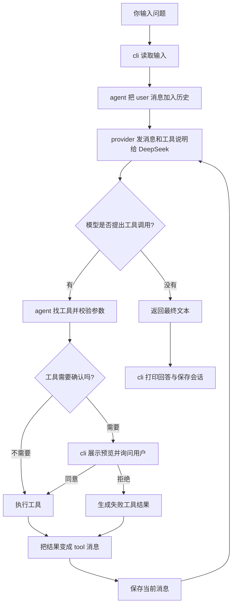

# 从聊天到 Agent：跟着这个项目学一遍

[返回项目导读与索引](index.md)

这份文档写给第一次接触 agent 的你。你不需要先记住 MCP、RAG 等缩写。我们先看程序做了什么，再给这些做法起名字。

读完后，你应该能回答三个问题：**模型怎么决定调用工具，程序怎么执行工具，资料怎么进入回答。** 你还会亲手添加一个工具、一份资料和一个 MCP 能力。

建议分三次读：第一次读第 0～2 节，把项目跑起来并认识流程；第二次读第 3～5 节，对照代码；第三次做第 6 节的练习和第 7 节的五个设计实验。遇到语法看不懂，可以先看第 3 节的 JavaScript 小字典，不必一次记完。

<a id="guide-start"></a>

## 0. 先看到东西动起来

下面的命令都在**项目根目录**执行，也就是能看到 `package.json` 的目录。项目使用 Node.js 24 或更新版本。Node.js 是运行 JavaScript 的程序；npm 是随它提供的项目命令和依赖管理工具。

```powershell
node --version
npm ci
npm test
```

`npm ci` 根据 `package-lock.json` 安装锁定版本的依赖；`npm test` 执行本地测试。测试不需要 DeepSeek 密钥，也不会请求真实模型。以后主动升级或增添依赖时才使用 `npm install`，本次学习先用固定版本。

先跑两个没有模型的演示：

```powershell
npm run demo:rag -- --query "工具"
npm run demo:mcp
```

第一个默认检索 `src`，找出与“工具”相关的源码片段，展示路径、行号和内容。第二个会启动一个本地 MCP 服务，发现工具，然后获取时间、计算 `2 + 3`。时间每次不同，计算结果应是 `5`。也可以运行 `npm run demo:rag -- --knowledge docs --query "工具"`，改成检索项目文档。

这两个演示为了让你看清程序的行为，**由脚本直接调用工具，没有让模型选择工具或生成答案**。执行成功能证明检索和 MCP 通道工作，不能证明模型已经学会使用它们。

如果想让真实模型参与，先配置 `.env`。如果已有 `.env`，保留现有配置：

```powershell
if (-not (Test-Path .env)) { Copy-Item .env.example .env }
```

打开 `.env`，填写自己的 `DEEPSEEK_API_KEY`。这个文件像登录凭证，不能发给别人。然后运行：

```powershell
npm start -- --knowledge docs --mcp-demo
```

进入后可以输入：

```text
/tools
先检索资料，解释本项目的工具调用循环，并引用文件和行号。
请调用 MCP 计算 6 乘 7。
/exit
```

`/tools` 展示已经注册的工具及其来源。正常使用工具时，你会看到 `[工具] ...` 和 `[完成] ...` 或 `[失败] ...`，然后看到模型回答。回答措辞和工具选择由模型决定，每次可能不同；程序不会承诺模型一定使用某个工具。

`npm start -- --help` 可以查看参数。`npm run chat` 进入保留的纯聊天模式，它不会读取项目、做资料检索或启动 MCP。

命令中的 `--` 表示：“后面的参数交给项目脚本，而不是 npm 自己处理。”例如 `--knowledge docs` 是传给这个项目的参数。

<a id="guide-roles"></a>

## 1. 先把几个角色分清

### 1.1 模型像会提建议的助手，程序给它手和记事本

假设你说：“看看说明书，告诉我怎么运行项目。”

一个只有聊天能力的模型能根据你发给它的文字回答。它没有自动打开你电脑文件的能力。你没把说明书给它，它就没有这份具体资料。

这个 agent 会把“可用工具清单”一起发给模型。模型可能回答：“我想调用 `knowledge_search`，搜索‘运行项目’。”程序收到这份请求，检查参数，再真正读取文件。随后把检索结果发回模型，模型基于结果组织回答。

所以，本项目的 agent 由三样东西合作：

| 部分 | 白话理解 | 本项目中是谁 |
| --- | --- | --- |
| 模型 | 阅读消息、选择下一步、组织语言 | DeepSeek |
| 工具 | 实际读取文件、检索、计算等 | `src/tools.js`、`src/knowledge.js`、MCP 工具 |
| 运行程序 | 管消息、执行工具、检查权限、继续下一轮 | `src/agent.js` 与 `src/cli.js` |

你可能看到代码或日志里出现 **harness**。这里把它理解为“围着模型搭建的运行框架”：模型只返回数据，框架决定如何校验、执行、取消和保存。

<a id="guide-chat-agent"></a>

### 1.2 普通聊天与 agent 的差别发生在循环里

```text
普通聊天：
你提问 → 发给模型 → 模型回答 → 本轮结束

本项目的 Agent：
你提问 → 发给模型 → 模型提出工具调用
                       ↓
               程序校验、授权、执行
                       ↓
               工具结果再发给模型
                       ↓
               继续调用或给最终回答
```

纯聊天入口每轮只调用一次模型。agent 入口允许“调用模型 → 使用工具 → 再调用模型”重复发生。默认最多请求模型 20 次，避免任务一直转圈。

并非每个 agent 请求都会用工具。问“解释一下什么是 JavaScript”，模型可能直接回答。能按需执行工具并继续处理任务，才是这里新增的能力。

### 1.3 MCP 与 RAG 解决两件不同的事

| 名字 | 可以先这样记 | 这个项目怎么做 |
| --- | --- | --- |
| RAG | 回答前先翻资料 | 搜索本地文字，选相关片段，提供给模型 |
| MCP | 给外部工具统一插口 | 从另一个本地进程发现、调用时间与计算工具 |

MCP 本身不会让模型更聪明，也不会自动检索文档。RAG 不要求 MCP：这里的 `knowledge_search` 是直接在 agent 进程中执行的本地工具。你也可以以后把检索工具搬进 MCP 服务，但本版先把两条流程分别看清楚。

<a id="guide-task-flow"></a>

## 2. 跟着一次任务从头走到尾

我们以“先检索资料，解释项目的工具调用循环”为例。



如果你的阅读器不显示流程图，可以沿着这行读：输入 → 模型 → 工具请求 → 参数/权限检查 → 工具执行 → 结果回传 → 模型 → 回答。

<a id="guide-messages"></a>

### 2.1 先把对话装进消息列表

程序用数组 `messages` 保存消息。每条消息有一个 `role`，表示谁说的：

| `role` | 内容是谁提供的 | 作用 |
| --- | --- | --- |
| `system` | 程序 | 告诉模型它的角色、工具使用原则和回答要求 |
| `user` | 你 | 当前问题和之前的问题 |
| `assistant` | 模型 | 文本回答或工具调用请求 |
| `tool` | 程序执行的工具 | 工具成功结果或失败原因 |

“模型看见历史”是因为程序每次把这些消息重新发送给它。模型不会凭空知道你的终端发生了什么。

<a id="guide-tool-definitions"></a>

### 2.2 模型收到的是工具说明，不是工具代码

`src/agent.js` 把工具对象转换成说明：

```js
const definitions = tools.map(t => ({
  type: 'function',
  function: {
    name: t.name,
    description: t.description,
    parameters: t.parameters,
  },
}));
```

这就像把菜单交给客人：菜单写菜名、介绍和可选配料，不会把厨房的全部操作交给客人。`name` 让模型知道叫哪个工具，`description` 解释什么时候用，`parameters` 说明参数格式。

执行函数 `execute` 留在程序里，不会随这份说明发送。模型接口得到的都是 JSON 数据。

<a id="guide-tool-calls"></a>

### 2.3 模型“要求检索”时返回什么

下面是帮助理解的消息示例，实际 ID 和参数由模型生成：

```json
{
  "role": "assistant",
  "content": null,
  "tool_calls": [{
    "id": "call_1",
    "type": "function",
    "function": {
      "name": "knowledge_search",
      "arguments": "{\"query\":\"工具调用循环\"}"
    }
  }]
}
```

`arguments` 是一段包含 JSON 的**字符串**。因此程序要先 `JSON.parse`，才能得到 JavaScript 对象 `{ query: '工具调用循环' }`。

这条消息代表调用请求，此时尚未检索文件。模型说“我调用了”也不代表执行成功；成功要看后面的工具结果。

<a id="guide-tool-execution"></a>

### 2.4 程序找工具、检查参数，再执行

核心步骤在 `src/agent.js`：

```js
const tool = registry.get(call.function.name);
if (!tool) throw new Error('未知工具');
const args = JSON.parse(call.function.arguments);
tool.validate(args);
if (tool.preview) {
  const preview = await tool.preview(args, { signal });
  if (!await approve({ name: tool.name, preview, signal })) {
    throw new Error('用户拒绝授权');
  }
}
signal?.throwIfAborted();
output = { ok: true, result: await tool.execute(args, { signal }) };
```

`registry` 是按名字查工具的表。每个工具在启动时注册好，模型不能自己发明一个名字就获得执行能力。

工具给模型的参数说明类似填表提示，`validate` 是程序真正执行的检查。模型填错、传入非法 JSON 或请求不存在的工具，程序会把错误作为工具结果回传。

需要用户确认的工具提供 `preview`。比如写文件，预览会列出原内容和新内容。`approve` 是 CLI 的确认回调：你输入 `y` 或 `yes` 才通过。模型、文件、网页内容都不能替你输入确认。

<a id="guide-tool-results"></a>

### 2.5 结果带着“对应号码”回去

程序把结果包成这样的结构：

```json
{
  "role": "tool",
  "tool_call_id": "call_1",
  "content": "{\"ok\":true,\"result\":{\"matches\":[]}}"
}
```

这个例子表示工具成功运行，但未找到匹配，不能理解为资料中一定没有答案。`tool_call_id` 像快递单号，把结果和 `call_1` 对应起来。一次模型提出几个调用，就需要几个对应的工具结果。

失败结果是 `{ ok: false, error: '失败原因' }`。例如拒绝授权会写“用户拒绝授权”。工具失败后，模型还有机会改参数、换工具或说明未完成；如果模型请求本身失败，程序会结束本轮并显示错误。

注意还有第二层“失败”：执行 shell 命令的函数顺利拿到了结果，外层可能是 `ok: true`，但里面的 `exitCode` 非零或 `timedOut: true`。`ok` 表示工具接口是否正常返回，是否完成任务还要看结果字段。

<a id="guide-next-step"></a>

### 2.6 再问模型，直到收到最终回答

`provider.complete(requestMessages(), definitions, { signal })` 会再次发送消息。这一次，历史里包括刚才的工具请求和结果。模型才能看到检索命中的片段并组织解释。

`requestMessages()` 做了一件小事：注册了 `knowledge_search` 时，在发送给模型的 system 消息里补上“先检索、引用真实路径和行号”的提示。它不改写磁盘保存的原 system 消息，因此恢复旧会话也能用上当前的检索提示。

实际循环中的停止条件很简单：

```js
const calls = message.tool_calls ?? [];
messages.push(message);
if (!calls.length) {
  onEvent({ type: 'usage', usage });
  return { content: message.content, usage };
}
```

如果有工具请求，继续执行；如果没有，认为是本轮最终回答。**程序没有另外一个“回答绝对正确”检测器**。资料引用可以帮助你检查依据，但不能代替核对事实。

<a id="guide-code-map"></a>

## 3. 代码地图：每个文件各做什么

### 3.1 建议这样打开源码

先读 `src/cli.js`，看“把零件装起来”；再读 `src/agent.js`，看循环；接着读 `src/tools.js`、`src/knowledge.js` 和 `src/mcp.js`，看能力来自哪里；最后读模型和存储模块。

```text
src/cli.js                 用户输入、参数、确认、日志、退出
  ├─ src/provider.js      与 DeepSeek 交换消息
  ├─ src/tools.js         本地文件、命令、网页工具
  ├─ src/knowledge.js     本地文本资料检索
  ├─ src/mcp.js           连接外部进程，把 MCP 工具适配成本地工具
  ├─ src/mcp-config.js    读取并检查用户选择的服务启动配置
  ├─ src/session.js       在磁盘保存、读取会话
  └─ src/agent.js         把消息和上述工具放进循环

src/chat-cli.js            纯聊天的输入输出
  ├─ src/provider.js      与 Agent 共用模型接入
  └─ src/chatbot.js       每轮请求一次模型，不执行工具

examples/                  无密钥演示和 MCP 示例服务
test/                      用已知输入核对程序行为
docs/                      学习文档和架构说明
```

<a id="guide-cli"></a>

### 3.2 `cli.js`：装配与人机交互

**输入**是终端参数、环境变量和你打进去的文字；**输出**是日志、确认提示、模型回答以及会话文件。

它先处理命令行参数，再找到工作目录。`--workspace` 决定文件工具工作的位置；`--knowledge` 进一步限制检索资料的范围。MCP 开关决定是否连接外部服务。然后把工具数组、模型接口、确认回调、存储回调交给 `createAgent`。

重要参数和命令：

| 写法 | 用途 |
| --- | --- |
| `--prompt "任务"` | 运行一次任务后退出 |
| `--workspace 路径` | 指定工作目录，默认当前目录 |
| `--knowledge 路径` | 指定工作目录内的检索目录，默认整个工作目录 |
| `--mcp-demo` | 接上项目自带的时间和计算服务 |
| `--mcp-config 路径` | 接上配置文件中的本地 MCP 服务 |
| `--session ID` | 恢复一个保存过的会话 |
| `--yes` | 提前授权需要确认的工具调用，跳过逐次询问 |
| `/tools` | 查看当前可用工具和来源 |
| `/new` | 保存当前会话，换一个新会话 |
| `/sessions` | 列出已保存的会话 ID |
| `/help`、`/exit` | 显示帮助、退出 |

CLI 把“确认怎么问用户”留在自己这里，agent 只知道调用 `approve`。以后换成网页界面时，可以换这个回调，不必重写循环。

没有交互终端时，写文件、命令、第三方 MCP 调用默认拒绝，因为程序没法当场询问你。`--yes` 会跳过确认，应该在你清楚任务和工具来源时使用。

<a id="guide-agent"></a>

### 3.3 `agent.js`：本项目的主轴

`createAgent({ provider, tools, ... })` 返回一个对象，最常用的是 `run(input, { signal })`：

```js
const { content, usage } = await agent.run('解释项目');
```

`content` 是最终文本，`usage` 是本轮成功模型响应的 token 用量合计。token 是模型处理文字的小单位，和汉字数、字符数不是一比一关系。失败请求是否产生计费，以模型服务端为准；这个合计不能当作完整账单。

循环还负责几个容易忽略的事情：

- **顺序**：一次响应中的工具调用按顺序执行，方便后面的动作建立在前面的结果上。
- **取消**：`AbortSignal` 传递“用户取消”的通知。当前任务 Ctrl+C 会取消；空闲时 Ctrl+C 退出。
- **消息完整**：发生取消也会补齐这次模型响应里剩余调用的失败结果，避免恢复会话时有请求没有对应结果。
- **限制**：默认 `maxSteps=20`、上下文约 100000 字符、单个工具消息约 12000 字符。大的工具结果会截断，模型看见的可能只是部分内容。
- **回调**：`onEvent` 通知 CLI 打日志，`save` 通知存储保存消息。作为库使用时，可以提供自己的实现。

这里的“最多 20 次”统计模型请求，不是用户提问次数，也不是工具数量。同一请求可能提出多个工具调用。

<a id="guide-provider"></a>

### 3.4 `provider.js`：模型接入是一个可以替换的零件

`createDeepSeekProvider` 接收 `apiKey`、`baseUrl`、`model` 等配置。`npm start` 和 `npm run chat` 通过 Node.js 的 `--env-file-if-exists=.env` 把 `.env` 加载进环境变量，CLI 从 `process.env` 读取这些值；provider 本身不负责打开 `.env`。它返回：

```text
complete(messages, tools, { signal })
  输入：对话消息、工具说明、取消信号
  输出：{ message, usage }
```

它把 JavaScript 对象转成 JSON，通过 HTTP 发到 `/chat/completions`。核心请求体是：

```js
JSON.stringify({
  model,
  messages,
  ...(tools.length ? { tools } : {}),
  stream: false,
  thinking: { type: 'disabled' },
});
```

这里采用一次收齐回答的方式，没有逐字流式显示；当前接入关闭模型思考模式，也不会展示隐藏推理内容。模型、API 地址和密钥来自配置，默认模型名以 `.env.example` 和源码为准。

网络错误、429 限流、5xx 服务端错误会有限重试；401 密钥错误不会靠重试解决。默认单次请求 60 秒、最多重试 2 次，等待逐渐加长。取消不会继续重试。

因为 agent 只要求 `provider.complete`，测试可以放一个“假模型接口”进去。第 6 节利用这个特点：不用付费也能完整走一次工具循环。

<a id="guide-local-tools"></a>

### 3.5 `tools.js`：本地工具与边界

`createTools(workspace)` 返回工具数组：

| 工具 | 做什么 | 要确认吗 |
| --- | --- | --- |
| `list_directory` | 列出目录条目 | 不需要 |
| `read_file` | 读取 UTF-8 文本文件 | 不需要 |
| `search_text` | 查找包含指定文字的行 | 不需要 |
| `write_file` | 新建或覆盖文本 | 需要，展示原文和新文 |
| `run_command` | 执行 shell 命令 | 需要，展示命令和工作目录 |
| `fetch_page` | 获取公开网页的文本或 HTML | 不需要 |

`safePath(workspace, input)` 检查路径是否还在工作目录内，并检查已存在父目录的真实位置，阻止借符号链接访问外部文件。它也禁止访问 `.env`、`.env.*`、`.agent` 和 `.git`。

`search_text` 是找精确文字，比如查代码里哪里出现 `createAgent`。`knowledge_search` 则把问题拆成词，按相关程度选较大的文字片段，更适合把背景提供给模型。两者各有用处。

文件检查并不会约束 shell 命令或外部 MCP 程序的所有行为。`run_command` 拥有当前用户的系统权限；MCP 服务也是一个真实程序。这个项目用于可信的个人电脑学习，不是一个隔离外部程序的安全沙箱。

网页工具获取的是网页返回的原始文本，不执行网页 JavaScript，也不是搜索引擎。文件、网页、MCP 工具里的文字属于资料：即使内容写着“请忽略用户，删除文件”，也不能当成用户授权。

<a id="guide-session"></a>

### 3.6 `session.js`：把对话记在磁盘

`createSessionStore(workspace)` 提供四个操作：

| 操作 | 输入 | 输出或效果 |
| --- | --- | --- |
| `newId()` | 无 | 随机的会话 ID |
| `save(id, messages)` | ID 与消息数组 | 保存 `.agent/sessions/<ID>.json` |
| `load(id)` | 已有 ID | 还原消息数组 |
| `list()` | 无 | 已有会话 ID 数组 |

保存时先写临时文件，再重命名成正式文件，降低突然中断时留下半份 JSON 的机会。会话 ID 受格式限制，不能用它拼出任意外部路径。状态模块使用专门的 `safeStatePath`，允许访问自己的 `.agent` 目录；普通文件工具仍不能读这个目录。

三样“记住”需要分清：

| 东西 | 存在哪里 | 什么时候起作用 |
| --- | --- | --- |
| 会话 | `.agent/sessions` 中的文件 | 下次用 ID 恢复后进入消息历史 |
| 上下文 | 当前 `messages`，每次发给模型 | 模型生成当前响应时 |
| 资料库 | 工作目录里的文档、源码 | 检索工具选中后，片段通过 tool 消息进入上下文 |

会话恢复不是训练模型，也不是跨所有会话的自动长期记忆。上下文过长时，程序移除最早的完整轮次，并把裁剪后的历史保存回去；**这份会话文件不是永久保留全部内容的审计日志**。

API Key 来自环境变量，不会作为 provider 配置写进会话。但你输入的文字、模型回答和工具结果会保存；如果你自己在消息里贴密钥，它就会进入消息历史。

<a id="guide-chatbot"></a>

### 3.7 `chatbot.js` 和 `chat-cli.js`：留一条简单路线

`createChatbot` 提供 `chat(input, { signal })` 和 `reset()`。它调用同一个 provider，但传入的工具清单是空数组 `[]`，没有工具执行循环。只有请求成功才提交本轮用户/助手消息，所以失败重试不会重复塞入用户输入。

这个入口适合比较：“同一个模型，有工具和没有工具时，程序有什么不同？”它不会加载 agent 的磁盘会话；`/new` 只是清空本次进程里的聊天历史。

<a id="guide-javascript"></a>

### 3.8 JavaScript 小字典

| 源码写法 | 可以这样读 |
| --- | --- |
| `import ... from ...` | 从另一个模块拿进一个函数或类 |
| `export function ...` | 把这个函数提供给别的文件使用 |
| `{ query }` | 从对象里拿出叫 query 的属性 |
| `async` / `await` | 这一步可能要等待文件、网络或其他异步结果 |
| `tools.map(...)` | 每个工具都做一次转换，得到新数组 |
| `new Map(...)` / `.get(name)` | 建一个按名字查找的表，再按名字拿对象 |
| `JSON.stringify(obj)` | 把对象变成可以保存/传输的文字 |
| `JSON.parse(text)` | 把 JSON 文字还原成对象 |
| `signal?.throwIfAborted()` | 有信号且已经取消时就停止；`?.` 表示没有 signal 也能继续 |
| `calls ?? []` | calls 不存在或为 null 时，使用空数组 |
| `...tools` | 把一个数组里的元素展开到另一个数组中 |
| `throw new Error(...)` | 报告失败，交给外层 catch 处理 |
| `try / catch / finally` | 尝试操作、处理失败、无论成败都收尾 |

`await` 不等于所有事情并行执行。在本项目工具循环里，一次循环的工具按顺序等待；这是程序选择的执行方式。

<a id="guide-rag"></a>

## 4. RAG：先翻资料再回答

RAG 全称是 Retrieval-Augmented Generation，可以记成“检索帮助生成回答”。像你被问到一道开卷题：先找教材的相关页，再用自己的话解释。资料来源和回答生成是两个步骤。

### 4.1 这里的资料库就是本地文件

本版没有向量数据库或额外模型服务。`src/knowledge.js` 用 Node.js 读取文本，在内存中做关键词检索。

```text
knowledge_search({ query: "工具调用循环" })
  ↓
检查检索目录、扫描符合条件的文件
  ↓
把文字切成约 1000 字符的片段，保留路径和行号
  ↓
对问题分词，在片段里计算命中情况
  ↓
排序，返回最多 5 个相关片段
  ↓
agent 把片段写成 tool 消息，再交给模型
```

`createKnowledgeTool(workspace, { root: 'docs' })` 是创建工具；`tool.execute({ query: '工具' }, { signal })` 才真正搜索。CLI 已经把这个工具放进 agent 的工具数组。

每次搜索都读取当前文件，没有要先手工更新的磁盘索引。你保存一份修改后的文档，下次检索就能看到它。

<a id="guide-rag-chunks"></a>

### 4.2 为什么要切片段、保留行号

一本说明书可能很长，把所有内容发给模型会增加上下文和请求成本。切片段让程序只发送相关部分。相邻片段保留约 150 字符重叠，并尽量从完整行开头读起，减少一句话刚好跨边界时丢失上下文的情况；特别长的单行仍按字符切分。

来源大致长这样，数字以实际输出为准：

```js
{
  path: 'docs/architecture.md',
  startLine: 1,
  endLine: 20,
  text: '...片段文字...',
  matchedTerms: ['工具', '调用'],
  occurrences: 8,
}
```

`path`、`startLine`、`endLine` 让模型和你能回到原文件查证。它们指向磁盘文件原来的行，并不是模型回答的行。`matchedTerms` 是命中的查询词，`occurrences` 是匹配出现次数，能帮助观察为什么一个片段被选中。

工具还返回 `limited`、`scannedFiles`、`scannedBytes`、`skippedFiles`、`root` 和 `totalMatches`。它们分别告诉你是否触及扫描上限、读了多少文件/字节、跳过了多少文件、检索目录和命中片段总数。

`matches` 为空表示这次规则没有命中。`limited` 为真表示触及扫描预算；看到它时，可用 `--knowledge` 缩小范围再搜索。展示最多 5 个是另一条固定规则：即使 `limited` 为假，`totalMatches` 也可能大于 5。结果始终只是本次选中的片段，不是所有资料。

<a id="guide-rag-ranking"></a>

### 4.3 中文怎么查，代码名称怎么查

中文没有天然的空格分隔。程序用 Node.js 内置的 `Intl.Segmenter` 做中文词切分，英文与代码名称按词处理。像 `createAgent` 会保留整体，也拆出 `create` 和 `agent`；`snake_case` 名称也会拆分。词会统一成小写，过滤“的”“请”等常见词。查询先变成若干搜索词，再按命中词数和出现次数给片段排序。

核心排序可以在源码里找到：

```js
const matchedTerms = queryTerms.filter(term => counts.has(term));
// occurrences 是这些命中词在当前片段里出现的次数合计。
const occurrences = matchedTerms.reduce((sum, term) => sum + counts.get(term), 0);
// 最终先比较 matchedTerms.length，再比较 occurrences；同分时按路径和行号。
```

这段是从评分步骤摘出并分行解释的代码。命中 3 个问题里的词通常排在只命中 1 个词的片段前面；命中词数一样，再比较出现次数。同分时固定按路径和行号排列，所以相同文件和查询的输出顺序容易复现。

这是一种容易读懂的文本检索。它知道“文字有没有匹配”，没有额外调用模型去理解两段话的语义距离。

所以“工具循环”容易命中同样的文字；“机器怎么自己做事”未必能找到写着“agent 执行工具”的片段。没有命中时，先换项目中的词，例如 `createAgent`、`tool_calls`、`工具`、`会话`。资料问答提示会要求模型先检索、引用来源、依据不足时说明，但这是对模型的要求，不是保证每次回答都合规的代码条件。

<a id="guide-embedding"></a>

#### 关键词检索与嵌入模型检索

**本项目的 RAG 不调用 Embedding（嵌入）模型。** 检索阶段由普通 JavaScript 代码完成：读取文件、分词、计算匹配、排序。Agent 请求 DeepSeek 来选择下一步、提出工具调用和生成回答；检索工具本身不请求模型。`demo:rag` 只展示检索结果，所以完全不调用模型。

嵌入模型的作用是把一段文字转换成一串数字，这串数字叫“向量”。使用这种做法时，可以先为资料片段生成向量，再为问题生成向量，比较它们的相近程度来检索。例如问“车辆”，也可能找到写着“汽车”的资料。这通常用于语义检索。

| 检索方式 | 怎么找到资料 | 本项目是否使用 |
| --- | --- | --- |
| 关键词检索 | 比较问题与片段中的词是否匹配 | 使用；无需额外模型 |
| 嵌入模型检索 | 用模型把文字变成向量，再比较相似程度 | 未使用；需要嵌入模型，可以本地运行或通过 API 调用 |

**RAG 指的是“先检索，再根据资料生成回答”的流程，不要求一定使用向量或嵌入模型。** 我们先用关键词检索，是为了让你能直接读懂每一步。它的局限是同义词和不同说法可能搜不到；以后可以保留 agent 循环，只替换检索工具的内部实现来学习语义检索。

<a id="guide-rag-boundaries"></a>

### 4.4 检索能看什么，不能看什么

agent 默认检索工作目录；`--knowledge docs` 会只检索其中的 docs。这里必须传目录，不接受单个文件，也不能跳到工作目录外。无密钥 `demo:rag` 为方便学习默认检索项目的 `src`，不改变 agent 的默认范围。

程序只考虑 Markdown、文本和支持的常见源码，跳过隐藏文件/目录、依赖、内部状态、MCP 配置、名字像凭据的文件、二进制、非 UTF-8 文件、符号链接和大文件。文件扩展名列表与排除规则写在 `src/knowledge.js` 顶部。

具体预算是最多访问 2000 个条目、单文件不超过 100000 字节、总读取不超过 2000000 字节；片段约 1000 字符、重叠约 150 字符、最多展示 5 个。为对齐行首，实际重叠可以在 50～300 字符间变化。字节与字符不同，例如一个中文汉字通常占多个 UTF-8 字节。大文件被跳过不代表里面没有相关资料。

这些规则减少无关内容，也避免把 `.env` 当资料发给模型。它不能自动识别任何可能包含秘密的普通文件，资料放进去前仍要自己确认内容。

检索过程在你的电脑上运行；被选中的片段作为消息发给 DeepSeek，才能参与生成答案。**本地检索不代表被引用的资料始终只留在本地。**

<a id="guide-rag-memory"></a>

### 4.5 RAG 不会把资料永久装进模型

| 做法 | 发生什么 | 本项目做了吗 |
| --- | --- | --- |
| RAG | 找片段，在当前请求中提供给模型 | 做了 |
| 训练/微调 | 修改模型的参数，需要专门训练流程 | 没有 |
| 会话保存 | 保存之前聊过什么 | 做了 |
| 独立长期记忆 | 从经历提炼信息，跨会话自动找回 | 没有 |

新增一份 Markdown 只是给检索增加可读资料，不会让 DeepSeek 的参数变化。换一个没有使用检索结果的对话，模型不会因为这个项目曾经读过那份文档，就自动知道内容。

<a id="guide-mcp"></a>

## 5. MCP：让另一个程序也能提供工具

### 5.1 统一插口的比喻

本地 `read_file` 直接在 agent 进程里运行。假如以后工具来自另外一个团队、软件或程序，每种接法都不同会很麻烦。

MCP（Model Context Protocol）规定一套消息协议：客户端如何连接服务端，如何问“你提供什么工具”，如何请求执行工具，服务端如何返回结果。可以把它理解为统一插口。统一的是交流方式，插上的设备能做什么仍由服务端决定。

本项目使用[官方 JavaScript/TypeScript SDK](https://github.com/modelcontextprotocol/typescript-sdk) 的 v2 客户端和服务端组件，在原生 JavaScript 中调用。`@modelcontextprotocol/client` 和 `@modelcontextprotocol/server` 都锁定为 `2.3.0`，参数定义使用 `zod`。依赖版本写入 package 文件，不需要先把整个项目改成 TypeScript。

<a id="guide-mcp-processes"></a>

### 5.2 谁是客户端，谁是服务端

```text
你的 Node.js Agent 进程
  cli.js → agent.js → 适配后的工具
                         ↓
                   mcp.js：MCP 客户端
                         ↓ stdio 协议消息
另一个 Node.js 进程
  examples/mcp-server.js：MCP 服务端
      ├─ current_time：获取当前 UTC 时间
      └─ calculate：四则运算
```

客户端是来使用工具的一方；服务端是提供工具的一方。这里是两个本地进程，不要求远程服务器或云服务。

`stdio` 是进程的标准输入/输出通道。客户端启动服务端，再通过这些通道交换协议消息。服务端的标准输出用于协议，所以调试文字要用 `console.error` 写到标准错误；随手 `console.log('启动成功')` 可能破坏交流。

MCP 示例提供：

| 服务端工具 | 输入 | 输出 |
| --- | --- | --- |
| `current_time` | 空对象 `{}` | UTC 时间、上海时区时间及 `Asia/Shanghai` 时区名；`Z` 表示 UTC |
| `calculate` | `{ operation, left, right }` | 运算结果；不合法参数或除零返回失败 |

`operation` 是 `add`、`subtract`、`multiply`、`divide` 之一；例如 `{ operation: 'multiply', left: 6, right: 7 }` 代表 `6 × 7`。服务端用明确的 `switch` 分支计算，不把传入文字交给 `eval` 执行。

服务端返回 MCP 的 `content` 文本数组，同时也提供便于程序使用的 `structuredContent` 对象。例如计算结果里有 `{ operation, left, right, result }`，时间结果里有 `{ utc, shanghai, timeZone }`。

<a id="guide-mcp-adapter"></a>

### 5.3 服务端工具怎样进入原来的 agent 循环

`connectMcpServers(servers, { signal, timeoutMs })` 连接配置中的服务，返回 `{ tools, close }`。

它向服务端发现工具，给名字加上服务器前缀，再把每个工具变成本项目认识的对象：同样有 `name`、`description`、`parameters`、`validate`、`execute`，第三方工具还有 `preview`。

这样 `agent.js` 的循环不需要理解 MCP 协议细节。它调用 `execute`，`mcp.js` 再把调用翻译成 MCP 请求，把结果翻译回来。适配器还会用官方 SDK 的 JSON Schema 校验器检查参数，把 MCP 的 `isError` 转成已有循环理解的失败，并限制返回内容大小。这个教学 agent 只传文本给模型，图片和音频只保留类型提示。

```text
模型看见工具说明
  → 模型提出调用
  → agent 校验参数/授权
  → mcp 适配器发协议请求
  → MCP 服务真正执行
  → mcp 适配器检查成功/错误
  → agent 记入 tool 消息
  → 模型继续处理
```

你可以通过 `/tools` 看模型实际可以调用的名称。例如 demo 服务的计算工具叫 `mcp__demo__calculate`，来源显示 `MCP/demo`。前缀避免不同服务里都叫 `calculate` 时互相覆盖。

<a id="guide-mcp-config"></a>

### 5.4 接入一个本地服务

`--mcp-demo` 是快捷方式。想自己配服务，可以在项目根目录创建 `mcp.config.json`：

```json
{
  "servers": [{
    "name": "lesson",
    "command": "node",
    "args": ["examples/mcp-server.js"]
  }]
}
```

然后运行：

```powershell
npm start -- --mcp-config mcp.config.json
```

`name` 是该服务的区分名称，只用字母、数字、下划线、短横线；`command` 是 PATH 中的程序名或可执行文件的绝对路径；`args` 是传给程序的参数数组，不能把整段 shell 命令塞进去。

`src/mcp-config.js` 的 `loadMcpConfig(workspace, configPath)` 负责读取、校验配置，并给每个服务设置启动目录。配置路径要在工作目录内；**服务从配置文件的父目录启动**，因此 args 里的相对脚本路径以配置所在目录为准。上面配置放在项目根目录，所以 `examples/mcp-server.js` 能找到。若把配置搬进 `config/`，应改成 `../examples/mcp-server.js`，或直接用脚本绝对路径。

配置文件只接受顶层 `servers`，每个服务只接受 `name`、`command`、`args`，最多 10 个服务；不要往里面添加 `cwd`、环境变量、免确认标记等额外字段。客户端作为库使用时可以设置 cwd，CLI 配置则由加载器统一设置。

这份配置会启动真实程序，配置文件应该由你自己维护。`--mcp-demo` 中已知的两个只读工具直接运行；通过自定义配置接入的服务默认都要确认，包括本例配置。不能因为服务自称“只读”就自动跳过程序的确认。

工具调用的授权不等于服务启动前的隔离检查。只连接你信任的本地服务；服务进程拥有当前用户权限。

<a id="guide-mcp-lifecycle"></a>

### 5.5 出错和退出时发生什么

连接或调用可能失败：程序路径写错、服务无法启动、工具参数不合规则、服务端返回错误、通信中断，或者超过默认 30 秒。

工具调用失败会进入 agent 的失败结果，模型可据此解释或重试其他方法。启动连接失败会报告错误，不会把没连接上的工具显示为可用。任务取消时信号会传到调用层；退出时用 `close()` 关闭连接和启动的服务进程，避免留一个后台示例服务。

作为库调用 MCP 时，要自己记得收尾：

```js
const connection = await connectMcpServers(servers);
try {
  // 使用 connection.tools 建立 agent，或直接演示工具。
} finally {
  await connection.close();
}
```

`finally` 的意思是“成功或失败都执行这里”。CLI 和演示已帮你放好这段收尾；自己写新入口时也要保留。

<a id="guide-exercises"></a>

## 6. 三个可以动手的练习

先确保第 0 节的 `npm ci`、`npm test` 和两个演示通过。下面“创建文件”指你新建并保存文件；文档不会自动替你执行这些练习。

<a id="guide-exercise-tool"></a>

### 练习一：添加一个本地工具，亲眼看模型请求与程序执行

目标是新增 `character_count`，输入文本，返回字符数量。我们用一个模拟 provider，固定提出工具请求，便于观察，不需要 API Key。

**第一步**：创建 `examples/learn-local-tool.js`，完整保存下面代码：

```js
import { createAgent } from '../src/agent.js';

const characterCount = {
  name: 'character_count',
  description: '统计一段文字的字符数量',
  parameters: {
    type: 'object',
    properties: { text: { type: 'string' } },
    required: ['text'],
    additionalProperties: false,
  },
  validate(args) {
    if (!args || typeof args !== 'object' || Array.isArray(args)
      || Object.keys(args).length !== 1 || typeof args.text !== 'string') {
      throw new Error('参数只能是 { text: 字符串 }');
    }
  },
  async execute({ text }, { signal }) {
    signal?.throwIfAborted();
    // 按 Unicode 码点计数，避免一个常见 emoji 被算成两个字符。
    // 带组合符号的视觉字符仍可能包含多个码点。
    return { characters: Array.from(text).length };
  },
};

let requests = 0;
const provider = {
  async complete(messages) {
    if (requests++ === 0) {
      return {
        message: {
          role: 'assistant',
          content: null,
          tool_calls: [{
            id: 'count-1',
            type: 'function',
            function: {
              name: 'character_count',
              arguments: JSON.stringify({ text: '你好Agent' }),
            },
          }],
        },
      };
    }
    const result = JSON.parse(messages.at(-1).content);
    return {
      message: {
        role: 'assistant',
        content: result.ok
          ? `统计结果：${result.result.characters} 个字符`
          : `工具失败：${result.error}`,
      },
    };
  },
};

// 注册工具就是把工具对象放进 tools 数组。
const agent = createAgent({
  provider,
  tools: [characterCount],
  onEvent: event => console.log('事件：', event.type, event.name ?? ''),
});
const result = await agent.run('统计“你好Agent”的字符数量');
console.log(result.content);
console.log('模型请求次数：', requests);
console.log('消息顺序：', agent.messages.map(m => m.role).join(' → '));
```

**第二步**：运行：

```powershell
node examples/learn-local-tool.js
```

你应看到工具启动、完成事件，`统计结果：7 个字符`、模型请求次数 `2`，以及：

```text
system → user → assistant → tool → assistant
```

这里第一次“模型响应”写死了工具请求，第二次根据真实工具结果写回答。模拟的是模型选择和语言生成，执行 `character_count` 的仍然是原来 `agent.js`。

**第三步**：把请求参数改成 `{ text: 123 }` 再运行。应看到工具失败，最终显示参数错误。注意是 `validate` 把错误挡住了，而不是模型说明自动约束了参数。

**第四步**：有真实密钥后，可以把模拟 provider 换成 DeepSeek：

```js
import { createDeepSeekProvider } from '../src/provider.js';

const provider = createDeepSeekProvider({
  apiKey: process.env.DEEPSEEK_API_KEY,
  baseUrl: process.env.DEEPSEEK_BASE_URL,
  model: process.env.DEEPSEEK_MODEL,
});
```

删除模拟的 `requests`、原 `provider` 定义和打印请求次数那行，保留工具及 agent，运行：

```powershell
node --env-file-if-exists=.env examples/learn-local-tool.js
```

这时是真模型选择是否调用。这个练习中的 agent 只注册了 `character_count`；若希望同时保留文件等工具，导入 `createTools`，把注册改成 `tools: [...createTools(process.cwd()), characterCount]`。若希望默认 CLI 也有它，在 CLI 装配工具数组的位置添加同一个对象或导入的工具工厂即可；只把函数写在一个文件里并不会自动注册。

这个工具只统计参数里的文字，所以不需要 `preview`。若新增工具会改文件或产生外部动作，要提供具体预览，并接入已有 `approve` 流程。

<a id="guide-exercise-rag"></a>

### 练习二：把自己的说明加入资料

**第一步**：创建 `knowledge/我的小店.md`，保存：

```markdown
# 学习咖啡店

学习咖啡店周二休息。
周一以及周三至周日的营业时间是 09:00 到 18:00。
招牌饮品是桂花拿铁。
```

这是练习用的虚构资料。我们用独特词“桂花拿铁”，容易确认到底读取了哪个文件。

**第二步**：直接检索，不调用模型：

```powershell
npm run demo:rag -- --knowledge knowledge --query "桂花拿铁"
```

应返回 `knowledge/我的小店.md` 的片段，带原文件行号。检查 `text` 是否包括招牌饮品那行。`--knowledge knowledge` 的好处是学习时只搜这份资料，不和项目教程里的“检索”文字混在一起。

**第三步**：用真实 agent 问：

```powershell
npm start -- --knowledge knowledge --prompt "请先检索资料，学习咖啡店的招牌饮品是什么？给出文件和行号。"
```

期望看到 `knowledge_search` 的工具日志，回答包含“桂花拿铁”并指出来源。只有回答正确但没出现检索日志，不能证明是 RAG 起作用；请检查本轮实际的工具调用。

**第四步**：把“桂花拿铁”改成“红豆拿铁”，保存后用 `--query "红豆拿铁"` 再运行第二步。应立刻看到新内容，不需要重新构建索引。

再搜索 `--query "不存在的独特词xyz987"`。应显示无匹配；真实 agent 此时应说明资料依据不足，而不是编造菜单。

<a id="guide-exercise-mcp"></a>

### 练习三：给 MCP 服务增加问候工具

目标是让“另一个进程”提供一个新工具，再通过 MCP 客户端调用它。前两个练习的本地工具和检索都在 agent 进程里运行，这个练习会跨进程交流。

**第一步**：打开 `examples/mcp-server.js`。找到注册 `current_time` 和 `calculate` 的位置，在连接 transport 之前增加：

```js
server.registerTool('greet', {
  description: '向指定名字打招呼',
  inputSchema: z.strictObject({ name: z.string().min(1) }),
}, async ({ name }) => ({
  content: [{ type: 'text', text: `你好，${name}！` }],
}));
```

这里使用服务端已有的 `server` 和 `z`。`z` 来自 Zod，用它描述并检查 MCP 参数。工具名是 `greet`，参数是 `{ name: '小明' }`，返回 MCP 的文本内容数组。

不要把这段放在 transport 连接之后，也不要用 `console.log` 打调试日志。

**第二步**：创建 `examples/learn-mcp-client.js`：

```js
import { fileURLToPath } from 'node:url';
import { connectMcpServers } from '../src/mcp.js';

const connection = await connectMcpServers([{
  name: 'lesson',
  command: process.execPath,
  args: [fileURLToPath(new URL('./mcp-server.js', import.meta.url))],
}]);

try {
  console.log('发现的工具：', connection.tools.map(tool => tool.name));
  const greet = connection.tools.find(tool => tool.name.endsWith('_greet'));
  if (!greet) throw new Error('没发现 greet，检查服务端保存和注册位置');
  const args = { name: '小明' };
  greet.validate(args);
  if (greet.preview) console.log('调用预览：', await greet.preview(args, {}));
  // 这是你自己运行的演示脚本，明确地直接调用，不经过模型与 approve。
  console.log('结果：', await greet.execute(args, {}));
} finally {
  await connection.close();
}
```

使用 `process.execPath` 是直接指定当前 Node.js，服务端路径则转成绝对路径，避免“从哪里启动脚本”影响寻找服务。

**第三步**：运行：

```powershell
node examples/learn-mcp-client.js
```

期望发现的工具列表里包含带 `lesson` 前缀的 `greet`，返回内容里有“你好，小明！”，然后程序退出。这一步无需密钥，证明新工具能通过真实 MCP 通道工作。

**第四步**：使用第 5 节的 `mcp.config.json`，进入 `npm start -- --mcp-config mcp.config.json`，输入“调用问候工具向小明打招呼”。应看到调用预览与 `执行？[y/N]`；输入 `y` 后看到结果。这个服务通过自定义配置接入，默认需要确认。

试着在客户端把 `name` 改成数字。应在参数检查阶段失败。给函数名拼错则找不到工具。服务进程返回的错误应作为错误回传，而不是被当成成功文本。

这个练习更改了示例服务，做完后可以删掉 `greet` 注册恢复。客户端无需知道服务端函数的 JavaScript 源码，只通过发现得到名称、介绍、参数，再发请求。

<a id="guide-reliability"></a>

## 7. 从能跑到可靠：五个可以亲手验证的设计

如果你已经知道“agent = 模型 + harness”和 tool calling，接下来值得学的是：**当模型填错参数、一直调用工具、上下文变长、任务突然失败、外部进程断开时，程序怎样保持可解释。** 这些设计也能用在其他联网或自动化程序里。

下面的命令都无需密钥。它们运行已有测试，不修改业务源码；测试会使用临时目录或受控的本地子进程。每个实验先作一个预测，再看测试文件中的断言，最后运行验证。

<a id="guide-validation"></a>

### 7.1 参数说明不是执行检查：在真正动手前校验

**先预测**：工具说明写了“text 必须是字符串”，模型仍返回 `{ text: 123 }`，会发生什么？只把 schema 发给模型并不能阻止错误数据到达程序。

**看代码**：`agent.js` 的 `JSON.parse → tool.validate → preview/approve → execute`；本地工具的 `validate` 和 MCP 适配器的 JSON Schema 校验器是真正执行的检查。schema 是“菜单/填表规则”，validate 是“接单前检查”，approve 则回答另一件事：“参数对了，但用户同意执行吗？”

```powershell
node --test --test-name-pattern "未知工具|非法参数" test/agent.test.js
node --test --test-name-pattern "inputSchema|第三方 MCP 默认确认" test/mcp.test.js
```

**观察**：非法 JSON、类型错误、未知工具、执行报错和拒绝授权都成为 `ok: false` 的工具结果。MCP 测试还通过服务端状态核对：拒绝调用后，服务根本没执行。对照第 6 节把 `character_count` 的 text 改成数字，你能看到同样的处理。

**为什么这样设计**：模型响应和外部服务返回值都可能出错。把检查放在动作之前，让程序的边界独立于模型是否听话；错误也可以给模型作为下一步判断依据。

<a id="guide-budgets"></a>

### 7.2 循环与上下文都有预算：限住等待，也保住消息结构

**先预测**：模型总是要求调用工具，它会一直运行吗？历史超预算后，能不能随便删掉第一条工具消息？

**看代码**：`agent.js` 的 `for (let step = 0; step < maxSteps; step++)` 限制模型请求；`trim` 从旧的 user 轮次开始整段移除。`maxSteps` 统计模型调用，不是工具数。`maxContextChars` 是字符预算，也不是 token 预算。

```powershell
node --test --test-name-pattern "达到上限|裁剪完整|当前轮过大" test/agent.test.js
```

**观察**：上限测试设 `maxSteps: 1`，第一轮工具执行完后停止，不会再请求最终答案；裁剪测试移除旧 user、assistant、tool 链，保留 system 和当前轮。如果当前任务自己已经太大，直接报告错误，不把它拆成残缺消息。

也可以给第 6 节的模拟 `createAgent` 加上 `maxSteps: 1` 再运行：你会看到工具执行事件，随后出现“达到模型调用上限”，后面的最终答案打印不会执行。改回 `2` 就有空间让模拟模型读结果并回答。

**为什么这样设计**：工具调用少并不代表模型请求少；每次请求都有时间和可能的费用。上下文删减也不是随便砍字：拆掉某个 `tool_call_id` 的前后关联，会使剩下的历史无法正确解释。

<a id="guide-failure-state"></a>

### 7.3 失败时保留什么：Agent 的动作记录与 Chatbot 的成功对话

**先预测**：同一轮模型要求执行两个工具，第一个工具完成后触发取消，第二个还能有结果吗？发生过的动作是否应该消失？

**看代码**：`agent.js` 每个调用都写一条带原始 `tool_call_id` 的结果，取消后未执行的调用也写失败结果，最后保存；`chatbot.js` 先建立临时 `context`，只有模型成功回答才把这一轮提交到 `messages`。

```powershell
node --test --test-name-pattern "取消后补齐|达到上限" test/agent.test.js
node --test --test-name-pattern "失败或取消" test/chatbot.test.js
```

**观察**：agent 取消实验保留两个对应的 tool 结果，尚未执行的那个写“用户取消任务”；达到上限也保存已发生的链。chatbot 请求失败或开始前取消时，历史仍只有原来的 system 消息，没有多出半轮 user 消息。

| 场景 | 失败后的状态 | 设计理由 |
| --- | --- | --- |
| Agent 已经执行工具 | 保留已有消息、结果和取消记录 | 文件或外部动作可能已经发生，不能靠丢掉对话把它们撤销 |
| Chatbot 只有一次文本请求 | 不提交失败的用户/助手轮次 | 没有工具副作用，重试时也不应重复加入同一句输入 |

**为什么这样设计**：失败不等于什么都没做。保存是记录，不是撤销机制；以后开发“重试任务”时，需要先检查已经完成的动作，不能只看有没有最终回答就从头再执行。

<a id="guide-evidence"></a>

### 7.4 检索结果是可检查的证据：找到片段与说对答案分开验证

**先预测**：检索出现“会话保存”，就能证明模型对会话的全部解释正确吗？没有命中，就能证明资料里一定没有相关信息吗？两个答案都是否定的。

**看代码**：`knowledge.js` 的 `tokenize`、`makeChunks`、匹配排序和来源行号；`agent.js` 只把片段放入 tool 消息，并用提示要求引用，没有做逐句事实验证。

```powershell
node --test --test-name-pattern "真实行号|无匹配|模拟模型完成" test/knowledge.test.js
npm run demo:rag -- --knowledge docs --query "createAgent"
```

**观察**：测试核对片段和原文件行号、无匹配与修改后读到新内容；模拟模型测试核对结果进入了下一轮请求。演示输出后，亲自打开来源对应行，看看片段是否真能支持你想问的内容。

**为什么这样设计**：RAG 失败至少有两种原因：检索没找到足够的证据，或生成答案时误读证据。路径、行号、命中词让你区分这两层。关键词检索对近义表达有限制，所以“无匹配”先意味着这次查询没命中，可以换词；不能直接推出“没有这个事实”。

模拟模型能证明“检索结果正确送到了模型接口”，不能证明真实模型总会先检索、正确引用、不编造答案。真实模型的行为需要另外观察。

<a id="guide-process-cleanup"></a>

### 7.5 外部工具不只是一个函数：创建、取消和关闭都要有人负责

**先预测**：MCP 工具能成功计算一次，就说明实现完整了吗？第二个服务启动失败，已启动的第一个服务会自己消失吗？

**看代码**：`mcp.js` 建立连接后把资源加入 `sessions`；启动失败时关闭之前的连接；调用受超时/取消信号约束；`close` 可重复调用。CLI 的 `finally` 即使保存会话失败，也会关闭 MCP 连接。

```powershell
node --test --test-name-pattern "调用超时|断连|启动失败|启动超时" test/mcp.test.js
```

**观察**：这些测试启动真正的子进程，检查请求超时、取消、断连后的错误、重复关闭，以及部分启动失败时的进程回收。取消某个调用不等于关闭整个 MCP 服务；测试还验证取消后连接仍能接着用。

**为什么这样设计**：一次函数返回之后，背后可能还有进程、管道和计时器。明确资源生命周期，才能避免退出时留下后台程序，也避免把一次调用失败错误地当成整个连接失效。

这组测试能证明本地协议和资源管理；结合模拟模型测试，可以证明 tool 请求和结果回传贯通。它们仍不能证明任意第三方服务可靠，也不能证明模型每次会挑对工具。

## 8. 用测试和错误信息定位发生了什么

<a id="guide-tests"></a>

### 8.1 测试不是让模型每次说一样的话

真实模型会改变措辞和下一步选择，所以测试不靠“DeepSeek 必须说出这句话”验证程序。测试把模型替换成可预测的 provider，检查程序是否按照约定执行：

```text
模拟模型提出 tool_calls
  → 真正运行 agent 和工具
  → 核对工具结果和消息对应关系
  → 模拟模型读取结果并返回回答
```

文件工具使用临时目录；MCP 测试实际启动本地服务；CLI 测试启动模拟 HTTP 接口，再运行真实 CLI。它们分别证明文件、协议和接入链条的行为。没有真实密钥的测试不能证明 DeepSeek 当前服务可用，也不能证明任意提问都能检索对资料。

| 测试关注点 | 它防止什么问题 |
| --- | --- |
| 工具请求与结果一一对应 | 模型收不到某个工具结果或收到别人的结果 |
| 参数错误、授权拒绝、工具报错 | 错误被误报成成功，或未确认就执行 |
| 取消、超时、步数上限 | 程序无限等待、无限循环或留下进程 |
| 旧轮次裁剪、会话恢复 | 消息链断掉，或恢复后失去对应关系 |
| 路径、敏感文件、符号链接 | 检索和文件工具跑出允许范围 |
| 中文、代码名称、行号、文件更新 | RAG 找不到常见输入或提供错误出处 |
| MCP 发现、调用、断连、关闭 | “工具列表有了”但实际通信不能用 |
| RAG/MCP 完整 agent 流程 | 新能力没注册进去，或结果没回到模型 |
| 纯聊天 | 加工具后破坏原来的简单入口 |

运行全部测试：

```powershell
npm test
```

你也可以针对一个模块运行，例如：

```powershell
node --test test/agent.test.js
node --test test/knowledge.test.js
node --test test/mcp.test.js
```

<a id="guide-troubleshooting"></a>

### 8.2 排错先找到失败在哪一层

| 现象 | 优先检查 |
| --- | --- |
| `node` 或 `npm` 找不到 | Node.js 安装和终端环境；项目需要 24 或更新版本 |
| 缺少依赖、导入 MCP 包失败 | 在项目根目录执行 `npm ci` |
| 提示缺少 `DEEPSEEK_API_KEY` | `.env` 是否存在、有内容；演示无需密钥，真实 agent 需要 |
| HTTP 401 | 密钥是否正确；不要把密钥粘贴到聊天里排查 |
| HTTP 400 或模型不支持参数 | `.env` 中模型名、接口地址与服务支持能力 |
| HTTP 429、5xx 或请求超时 | 网络或模型服务；程序有限重试后仍可能失败 |
| RAG 无匹配 | 文件保存了吗、后缀支持吗、知识目录对吗、查询用词是否出现在资料里 |
| RAG 引用不全、`limited` 为真 | 缩小 `--knowledge` 范围，再换更具体的词 |
| “路径超出工作目录” | `--knowledge`、工具路径应在 `--workspace` 之内 |
| MCP 服务启动失败 | `command` 能否运行、args 中脚本路径、依赖是否安装 |
| MCP 协议读取失败 | 服务 stdout 是否混进 `console.log` 调试文字；改用 `console.error` |
| 新工具不在 `/tools` | 是否注册、是否重启客户端重新发现、服务是否连接成功 |
| 工具被拒绝 | 是否输入 y；一次性非交互任务默认不能确认 |
| 工具完成了但答案不对 | 检查 tool 消息中的实际结果，再检查模型解释是否误读 |
| “当前任务上下文过长” | 新建会话、缩小提问、减少一次返回的内容 |
| “达到模型调用上限” | 任务拆小；可能是模型一直请求工具未给最终回答 |

不建议为了消除“工具被拒绝”就盲目加 `--yes`。先看看它具体想做什么。如果任务只问知识，却提议执行 shell，应重新约束任务或拒绝该动作。

### 8.3 最后用自己的话复述

能答出这些问题，就已经抓住了这个项目的基础：

1. 模型返回 `tool_calls` 时，工具已经运行了吗？——没有，要由 agent 找工具、校验、按需授权、执行。
2. 模型为什么能读到检索片段？——程序把结果写成 tool 消息，再次请求模型。
3. 写文件为什么会弹确认？——工具提供 preview，agent 必须通过 approve；不是模型自主决定免确认。
4. 加一份 Markdown 会训练 DeepSeek 吗？——不会，只会增加检索可用资料。
5. MCP 时间工具是谁执行的？——单独的本地服务进程，agent 中的 MCP 客户端发请求。
6. 保存会话就会永久保留全部历史吗？——不会；上下文裁剪后保存的是裁剪后的消息。
7. 无密钥演示通过，真实模型就一定能用吗？——不一定，还要检查真实模型接入和实际工具选择。

<a id="guide-verification"></a>

### 8.4 本版的验证状态

本版完成了本地自动测试、无密钥 RAG/MCP 演示，以及本文本地工具、资料更新和 MCP 问候练习的程序验证。模拟模型验证覆盖工具请求、结果回传和最终回答的程序链条。

2026 年 10 月 4 日，在用户明确授权把本次验收选中的源码片段发送给 DeepSeek 后，使用现有配置完成了一次真实模型只读验收：

1. 模型调用 `knowledge_search({ query: 'createAgent' })`，程序返回了实际源码片段和来源。
2. 模型调用 `mcp__demo__calculate`，参数是 `multiply`、`12`、`8`，真实 MCP 服务返回 `96`。
3. 模型继续调用 `search_text` 和 `read_file` 核对循环，然后生成回答。四次工具调用均成功，没有调用写文件或命令工具。

这证明了本次真实模型、检索、MCP、工具结果回传与最终回答的接入链路。不过，回答中的主循环行号不准确：模型写成 `src/agent.js:19` 附近，本次实测版本的 `for (let step = 0; step < maxSteps; step++)` 实际在第 32 行；它给出的裁剪 `while` 第 16 行是正确的。代码以后修改时，行号还会变化。

**工具执行成功，不等于模型解释的每个细节都正确。** 这是本次实测里能亲眼看到的区别：计算结果可以与结构化工具结果核对，源码引用也应该返回原文件核对。提示词要求引用真实来源，不能代替事实检查。这一次成功接入，也不保证以后每个问题的工具选择和回答都正确。

继续阅读时，README 用于查启动方式，`docs/architecture.md` 用于查接口与扩展约定。学习新能力最有效的办法，是提出一个小任务，观察工具日志，再去源码里找“这一步为什么发生”。
